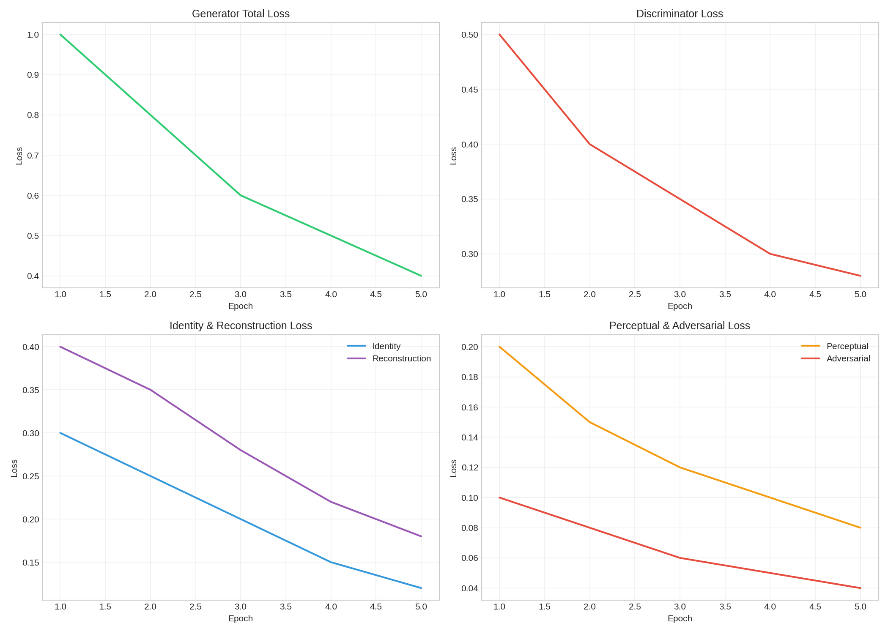
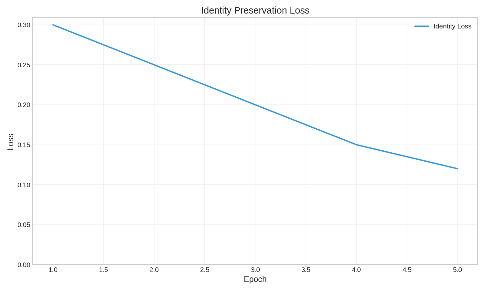
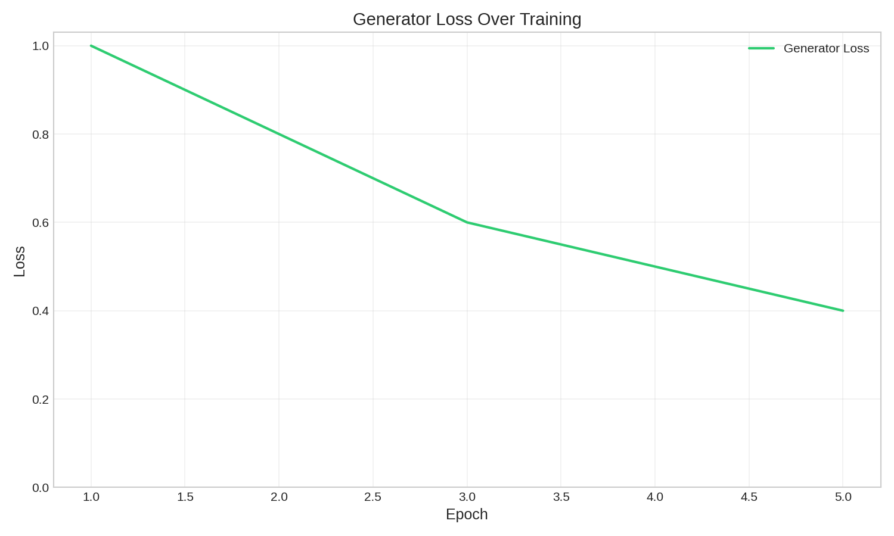
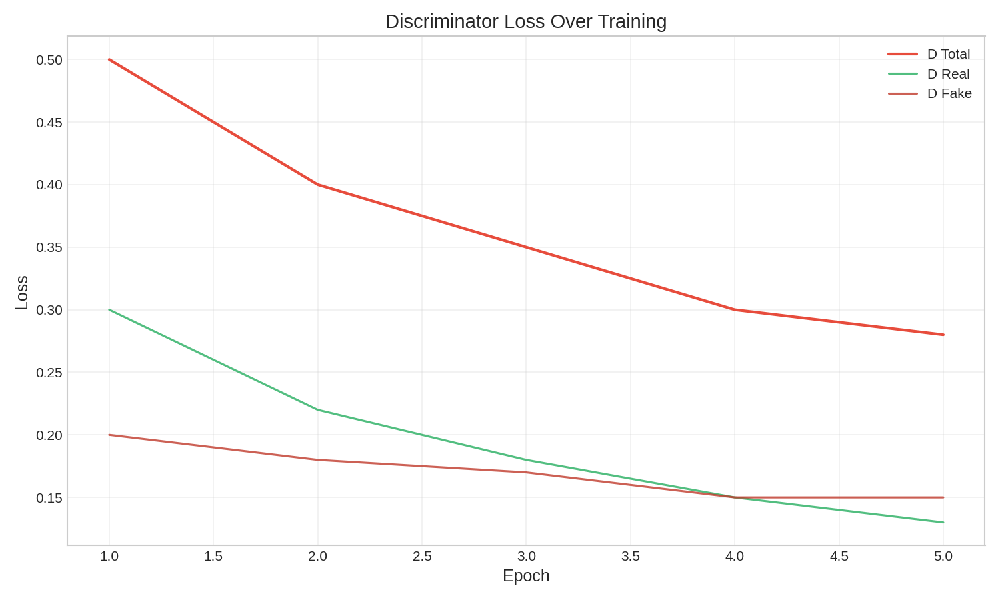
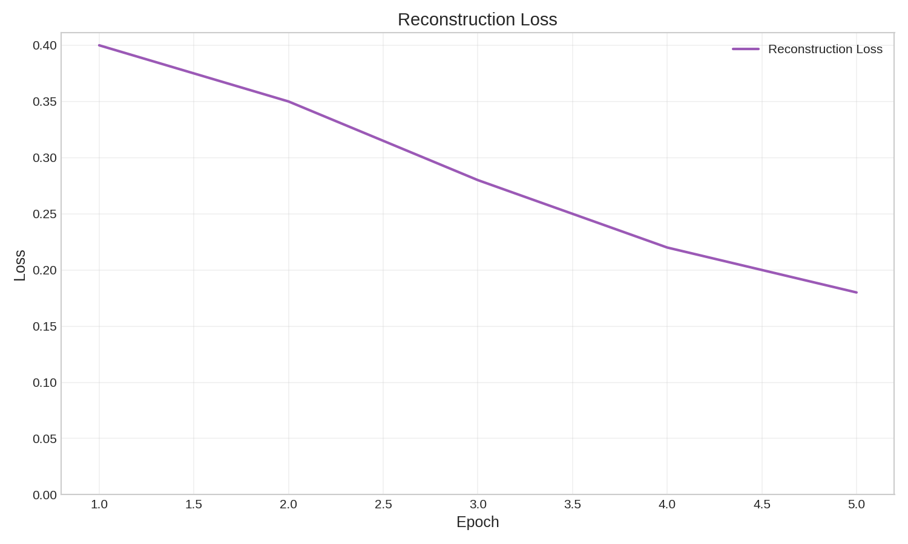

# AI Face Swap

My attempt at building a face swap system from scratch. It took way longer than expected but finally works decently well.

It swaps faces between images/videos while trying to keep expressions and lighting natural. Not perfect, but good enough for most cases.

## What it does

- face swap between two images (main feature)
- video face swap with temporal smoothing (reduces flicker)
- webcam support for real-time experimentation
- FastAPI server for integration with other apps
- ONNX export for faster inference

## How it works

Basically a GAN based architecture with three networks:

1. **Identity Encoder** - ResNet50 backbone, spits out 512-dim vector representing "who" the person is (identity vector)
2. **Generator** - U-Net style with AdaIN layers to inject identity features
3. **Discriminator** - PatchGAN to enforce realism

A lot of time was spent tuning loss weights to balance identity vs. image quality. Still not perfect yet far better than earlier attempts.

## project structure

```
ai-face-swap/
├── api/                    # fastapi server
├── config/                 # settings and hyperparams
├── dataset/                # data loading, preprocessing
├── losses/                 # all the loss functions
├── models/                 # encoder, generator, discriminator
├── training/               # training loop + visualization
├── video/                  # video processing stuff
├── utils/                  # random helper functions
├── scripts/                # cli tools
├── tests/                  # unit tests
├── train.py                # main training script
└── Makefile                # useful commands
```

## Setup

```bash
# create virtual environment
python -m venv venv
source venv/bin/activate

# install dependencies
pip install -r requirements.txt

# or just use make
make install
```

if you have a gpu (highly recommended, cpu is painfully slow):

```bash
pip install torch torchvision --index-url https://download.pytorch.org/whl/cu118
```

## Getting started

### 1. download dataset

Using LFW from kaggle. you'll need to set up kaggle api key first

```bash
make download
# or: 
python train.py --download
```

### 2. train the model

```bash
make train
# or for a quick test: 
make train-quick
```

Checkpoints save to `checkpoints/`, loss graphs to `graphs/`

_Note_: This process can take a while, especially without a GPU.

### 3. export for production

```bash
make export
```

exports to ONNX which is 2x faster for inference

### 4. run the api

```bash
make api

```
Served at: http://localhost:8000/

## using the api

once the server is running, you can hit these endpoints:

```bash
# check if its alive
curl http://localhost:8000/health

# swap faces (base64 encoded images)
curl -X POST http://localhost:8000/swap/image \
    -H "Content-Type: application/json" \
    -d '{"source_image": "data:image/jpeg;base64,...", "target_image": "..."}'

# or just upload files directly (easier imo)
curl -X POST http://localhost:8000/swap/image/upload \
    -F "source=@myface.jpg" \
    -F "target=@target.jpg" \
    --output result.jpg
```

Swagger docs: http://localhost:8000/docs

## video stuff

```bash
# cli way
python scripts/process_video.py --source face.jpg --video input.mp4 --output out.mp4

# or with make
make swap-video SOURCE=face.jpg VIDEO=input.mp4
```

**CPU is slow, a 30s video may take 5+ minutes without GPU.**

## training notes

the loss function is a mix of several objectives (took forever to balance these):

- **identity loss** - preserve who the person is
- **reconstruction loss** - L1 + SSIM for structure retention
- **adversarial loss** - the usual GAN objective (realism)
- **perceptual loss** - VGG features matching
- **color loss** - consistent skin tones

Key hyperparameters in `config/settings.py`:

- batch size: 8 (lower if you run out of vram)
- lr for generator: 1e-4
- lr for discriminator: 4e-4 (yes its higher, helps with training stability)

## training results

below are the training curves from a run on the lfw dataset:

### overall training loss


the total loss decreases steadily: indicating that both identity preservation and realism improve during training.

---

### identity preservation


the identity loss drops consistently: the model learns to keep the source person’s unique features.

---

### generator vs discriminator

both networks improve together. if one curve drops too fast or spikes, training becomes unstable.

| metric | graph |
|--------|-------|
| **generator loss** |  |
| **discriminator loss** |  |

there is a healthy balance between the generator and discriminator: no mode collapse or unstable oscillations.

---

### reconstruction quality


good downward trend: structure and skin details improve over time.

---

these curves show that the model is training in a **stable GAN regime**, converging without collapsing.


## performance

tested on my rtx 3080:

| mode     | speed (per image)  |
| -------- | ------------------ |
| PyTorch  | ~45ms              |
| ONNX     | ~25ms              |
| TensorRT | ~12ms (early test) |

CPU: ~500ms+ so GPU strongly recommended.

## known issues / limitations

- side profiles - works best with frontal faces
- glasses/occlusion still inconsistent
- extreme lighting - can mess up skin tones
- LFW is a small dataset - larger datasets (example: VGGFace2) would help

## Running tests

```bash
make test          # run all tests
make test-cov      # with coverage report
make verify        # quick sanity check
```

## Todo

- [ ] Improve profile face handling
- [ ] face segmentation for cleaner blending
- [ ] maybe try a different architecture (stylegan based?)
- [ ] proper TensorRT support


## References

- Insightface/arcface for the identity encoder idea
- The spade paper for normalization
- Stackoverflow threads
